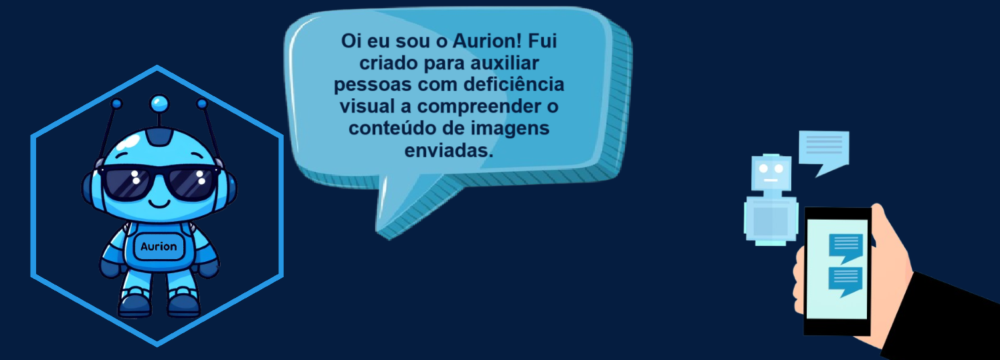
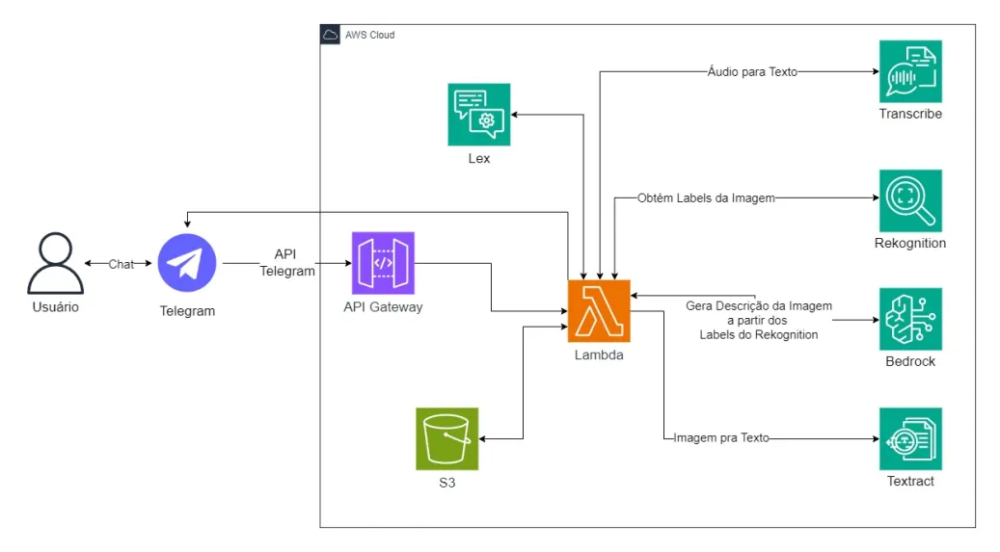

<h1 align="center">Bot para Auxiliar Pessoas Cegas ou Com Baixa Visão</h1>
<h2 align="center"> <i>Aurion</i></h2>




## 🌐 Sobre o Projeto
<p align="justify"> 
Este bot será desenvolvido com o objetivo oferecer uma ferramenta inclusiva para pessoas cegas, inspirada no movimento <a href="https://mwpt.com.br/criadora-do-projeto-pracegover-incentiva-descricao-de-imagens-na-web/">#ParaCegoVer</a>, que incentiva a descrição de imagens na web. A iniciativa, criada por uma defensora da acessibilidade visual, tem como propósito tornar o conteúdo digital mais acessível para pessoas com deficiência visual, promovendo a inclusão e a equidade. Integrado ao Telegram, o bot permitirá que os usuários enviem imagens para receber descrições detalhadas em áudio ou texto.
</p>

<p align="justify">
O bot estará disponível publicamente no Telegram, onde os usuários poderão interagir de maneira simples e eficiente. Dessa forma, este bot ofecerá uma solução inclusiva e tecnológica para que pessoas cegas possam compreender o conteúdo de imagens de forma acessível. A combinação dos serviços AWS permitirá uma interação fluida e eficaz, com descrições em áudio de alta qualidade e uma experiência de usuário otimizada.
</p>

## 🏗️ Arquitetura do Projeto


## 🚀 Como utilizar
No telegram, busque por ``Aurion, Seu assistente visual`` e inicie a conversa.

## 📂 Estrutura das Pastas
```bash
  📁 sprints-9-10-pb-aws-abril
  │
  ├── 📁 assets
  │   ├── Arquitetura.png
  │   └── banner.png
  │          
  ├── 📁 src
  │   │
  │   └── 📁 chatbot
  │   │   └── aurion.zip
  │   │
  │   ├── 📁 lambda
  │   │   ├── bedrock.py
  │   │   ├── dynamo.py
  │   │   ├── image_processing.py
  │   │   ├── lambda_function.py
  │   │   ├── lex_interaction.py
  │   │   ├── rekognition.py
  │   │   ├── telegram_interaction.py
  │   │   ├── textract.py
  │   │   └── transcribe.py
  │                                                    
  └── README.md                                 
```

## 💻 Tecnologias
- AWS Bedrock
- AWS Rekognition
- AWS Transcribe
- AWS S3
- AWS Lex
- AWS Textract
- API Gateway
- Telegram
- Python


## 👨‍💻 Autor

<p>Pâmela Aliny Cleto Pavan</p>
<p>pamelaaliny@gmail.com</p>
